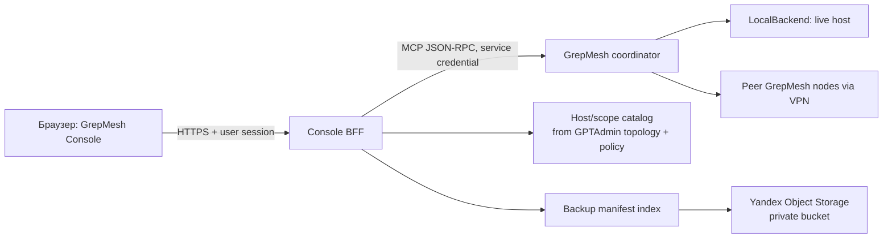

# GrepMesh Console: план веб-интерфейса

## Решение в одной фразе

Сделать desktop-first **GrepMesh Console**: быстрый поисковый пульт, где оператор
сначала задаёт запрос, затем сужает его по компьютеру → логическому тому (named
root) → папке, а результаты из живой файловой системы и из резервных копий
показываются рядом, но никогда не смешиваются без явной маркировки источника и
снимка.

Под «CMless» в этом плане понимается отсутствие центрального файлового сервера:
каждая машина остаётся владельцем своих разрешённых путей, а центральный слой
держит только каталог, авторизацию, запросы и метаданные. Файлы не нужно
монтировать или копировать в единое хранилище ради поиска.

## Что уже подтверждено в GrepMesh

| Факт | Следствие для UI |
|---|---|
| Есть `search_text`, `find_paths`, `read_text`, `search_status`. | Первая версия не изобретает собственный поисковый движок; она вызывает эти операции через серверный адаптер. |
| Запрос выбирает `hosts`, named `roots`, glob-пути, режим поиска, число строк контекста и лимит. | Фильтры «компьютеры», «тома/корни», «папка», режим и лимит напрямую отражают существующий контракт. |
| Многомашинный поиск может вернуть `job_id`, частичные данные, `partial`, `truncated`, `host_status` и cursor-пагинацию. | Экран обязан показывать ход поиска, недоступные машины и обрезание результатов; «ничего не найдено» допустимо только после завершения без частичных ошибок. |
| Roots — это настроенные абсолютные пути, а не подтверждённый список физических дисков. | В UI слово «Том» означает **логический scope**: `host + root_name + allowed_paths`. Автообнаружение всех дисков — отдельная будущая функция, не часть MVP. |
| Пиринговый сервер рассчитан на приватную сеть/VPN и Bearer-токен между узлами; при внешнем bind требует отдельный localhost endpoint. | Браузер не обращается к узлам GrepMesh напрямую и никогда не получает peer token. |
| В исходнике нет Yandex Object Storage/S3-адаптера или поиска резервных копий. | S3 — отдельный read-only backup adapter, а не «ещё один host» и не скрытая часть текущего поиска. |

Авторитетный исходник: `/home/admin/agents-projects/grepmesh`. Карта кода
подтверждает основные узлы: `MeshService`, `LocalBackend`, `IndexManager`,
`Topology`, `SearchJobs`, `AppConfig`.

## Целевой пользовательский сценарий (MVP)

1. Оператор вводит `invoice_2025` или фразу из файла в одну строку поиска.
2. Видит, какие из машин уже ответили, и при необходимости оставляет только
   `server01` и scope `projects`.
3. Выбирает результат, открывает безопасный текстовый preview вокруг совпадения
   и понимает полный путь, машину, scope и время ответа.
4. Рядом видит независимый бейдж: «В backup есть 3 снимка» либо «backup не
   проверен». Нажатие показывает список снимков, а не скачивает файл.
5. При недоступности одной машины результаты остальных остаются видимы, а
   причина явно показана в статусе машины.

Краткий реальный canary после реализации: через браузер найти заранее известный
файл на двух подключённых хостах, отфильтровать один scope, открыть preview и
увидеть состояние его backup-снимка без выдачи токенов S3 в браузер.

## Информационная архитектура и экран

### Термины

- **Машина (Host)** — GrepMesh `host_id`.
- **Том / Scope** — разрешённый named root на машине. Это честнее, чем обещать
  список всех физических томов ОС.
- **Папка** — пользовательское сужение внутри scope; валидируется сервером,
  чтобы не выйти за разрешённый root.
- **Live result** — результат текущего чтения на машине.
- **Backup snapshot** — конкретный неизменяемый снимок в Object Storage, с
  `snapshot_id` и временем создания.

### Главный экран

```text
┌ GrepMesh  [⌘K Найти файлы, текст, проекты…] [Live ▾]  [● 3/4 hosts]  [Профиль] ┐
├───────────────┬───────────────────────────────────────────────────┬──────────────┤
│ КОМПЬЮТЕРЫ    │ РЕЗУЛЬТАТЫ                                          │ PREVIEW      │
│ ● server-100  │ 142 совпадения · 3 машины · 0.34 s                  │ path         │
│   ▸ projects  │ ───────────────────────────────────────────────── │ host/scope   │
│   ▸ home      │ server01 / projects / billing/invoice_2025.csv    │ линии 42–68  │
│ ◐ server01   │  Live · текст · 18 KB · 4 совпадения               │              │
│   ▸ projects  │  [Backup: 3 снимка]                                │ безопасный   │
│ × mac-mini    │                                                     │ текстовый    │
│               │ server-100 / home / archive/...                    │ preview      │
│ Фильтры       │  Live · путь · 1.2 MB                              │              │
│ [*.rs] [код]  │                                                     │ [Снимки]     │
│ [≤ 100 KB]    │  Показано 100 из 142  [загрузить ещё]              │ [Открыть…]*  │
└───────────────┴───────────────────────────────────────────────────┴──────────────┘
* «Открыть» появится только при отдельном разрешённом действии.
```

Принципы визуала:

- Поиск — главный объект, а не дашборд. На wide screen — три колонки, на
  мобильном — список и preview как страницы; первый релиз оптимизирован под
  desktop.
- Цвет статуса не является единственным сигналом: `готово`, `ищет`,
  `частично`, `недоступен`, `устарело` всегда написаны текстом.
- Каждая строка результата содержит минимум: host, scope, путь, тип, размер
  (если доступен), источник `Live`/`Backup`, количество совпадений.
- Ввод поиска поддерживает строки, путь-шаблон и режимы `literal`,
  `case-insensitive literal`, `regex`. Regex получает заметный бейдж и понятную
  ошибку валидации.
- Пустой экран предлагает три примера: «найти проект», «найти имя файла»,
  «найти текст на всех машинах»; не изображает фальшивую активность.

### Поверхности

1. **Command palette / Search bar** — запрос, chips выбранных scope, фильтр
   Live/Backup, последний поиск, быстрые сохранённые запросы.
2. **Navigator слева** — дерево `Host → Scope → Folder`; только зарегистрированные
   пути, health и число результатов. Список физических томов не эмулируется.
3. **Result stream в центре** — инкрементально приходит из job/polling, группируется
   по host, сортируется по точному совпадению/пути/времени, сохраняет порядок при
   появлении новых ответов.
4. **Inspector справа** — текстовый preview (строки, а не полный файл), свойства
   live-результата, вкладка «Backup snapshots», копирование пути. Кнопки чтения/
   скачивания скрыты до появления отдельной policy.
5. **Панель состояния** — latency, `partial`, `truncated`, подробности по каждой
   машине, cursor «следующая страница». Она не пропадает после завершения поиска.
6. **Каталог и доступы** — отдельный admin-only экран: hosts, scopes, источник
   topology, freshness/generation, кто имеет право искать/читать/восстанавливать.

## Архитектура



### Почему BFF обязателен

GrepMesh служит MCP/peer-контракту: он проверяет peer bearer token, origin и
правила bind. Это не готовая браузерная авторизация, каталог прав и аудит
пользователя. Console BFF:

- авторизует человека (предпочтительно через существующий SSO/GPTAdmin);
- проверяет `search`, `preview`, `backup:list`, `restore:request` по
  `user × host × scope`;
- хранит MCP и S3 credentials только на сервере;
- нормализует MCP responses в стабильный UI contract;
- пишет audit event без текста файла и без секрета;
- отдаёт SSE/WebSocket только для статуса поисковой задачи.

### UI API: минимальный контракт

| Endpoint | Назначение | Источник |
|---|---|---|
| `GET /api/catalog` | hosts, scopes, health, topology freshness, разрешения | GPTAdmin topology + BFF policy |
| `POST /api/searches` | принять query, mode, host_ids, scope_ids, folder, glob, limit | BFF → `search_text`/`find_paths` |
| `GET /api/searches/{id}` | итог, host statuses, `partial`, `truncated`, cursor | BFF job store + `search_status` |
| `GET /api/results/preview` | ограниченный preview по result identity | BFF → `read_text` после policy check |
| `GET /api/backups/availability` | наличие и число snapshot для live identity | backup manifest index |
| `GET /api/backups/snapshots` | список immutable snapshot и метаданные | backup manifest index |
| `POST /api/restores` | только заявка/approve-able intent, не мгновенный restore | отдельный restore workflow |

`result_id` должен быть непрозрачным, подписанным или серверно сохранённым; UI
не подставляет произвольный путь в `read_text`. Базовый ключ live-результата:
`host_id + scope_id + normalized_relative_path + observed_at`.

### Поисковый поток

1. UI отправляет один запрос с выбранными host/scope и малым foreground budget.
2. BFF валидирует права, папку и предел результата; вызывает существующий MCP.
3. Если поиск готов — BFF сразу отдаёт результаты. Если есть `job_id` — создаёт
   UI search session и опрашивает `search_status` с backoff.
4. UI получает merged results и обновления статусов без спиннера поверх уже
   найденного.
5. `partial=true` раскрывает список проблемных host; `truncated=true` показывает
   cursor/уточняющие фильтры, а не «полный список».
6. Preview является отдельным разрешённым запросом, с лимитом строк и размера.
7. Availability lookup запускается после появления live result, пачками; оно не
   задерживает live search.

## Yandex Object Storage: правильная модель backup-поиска

### Не делать

- Не давать браузеру S3 key/secret, presigned wildcard или peer token.
- Не обходить бакет на каждый keystroke: это медленно, дорого и не даёт хорошей
  сортировки.
- Не выдавать snapshot как текущий файл и не запускать restore одним кликом.
- Не индексировать содержимое всех резервных копий по умолчанию: это резко
  расширяет поверхность утечки и стоимость.

### Делать: manifest-first adapter

Каждый backup job публикует immutable manifest, например:

```text
manifests/v1/{host_id}/{scope_id}/{snapshot_id}.jsonl.gz
```

Запись manifest: `host_id`, `scope_id`, нормализованный относительный путь,
`snapshot_id`, `captured_at`, размер, checksum/etag, content_type,
object_key, deleted/tombstone, encryption metadata. Object key приватен и не
отдаётся UI.

Backup importer читает только новые manifests и кладёт поисковые метаданные в
внутренний `backup_manifest_index` (Postgres для общего сервиса; SQLite допустим
только для одного BFF). Так availability lookup — индексный запрос по ключу live
результата, а не S3 list.

### Этапы S3

1. **Inventory MVP** — подключить bucket read-only, проверить endpoint/region,
   версионирование, шифрование, layout и существующие snapshots; показать только
   состояние «backup configured / last import / stale».
2. **Manifest import** — индексировать имена/размеры/даты/снимки; показывать
   бейдж и вкладку snapshots.
3. **Restore request** — пользователь выбирает snapshot и target scope, BFF
   создаёт audited approval request; worker выполняет restore только после
   отдельного подтверждения и вне исходного пути либо в quarantine.
4. **Опциональный content index** — только для явно разрешённых нешифрованных
   или безопасно расшифровываемых типов; отдельная retention policy и permission
   `backup:content-search`. Это не входит в MVP.

### Честный UX для разных состояний

| Состояние | Текст в UI |
|---|---|
| Live найден, snapshot есть | `Backup: 3 snapshots, latest 2026-08-17 02:10` |
| Live найден, import ещё не покрывает scope | `Backup: coverage unknown` |
| Live нет, найден только backup snapshot | `Backup only · snapshot … · не является текущим файлом` |
| S3 importer stale | `Backup catalog stale since …` + причина |
| Нет права | `Backup metadata restricted` без утечки ключа или имени объекта |

## Безопасность, скорость и надёжность

- **Least privilege:** роли `catalog:view`, `search`, `preview`, `backup:list`,
  `restore:request`, `admin`; scopes назначаются на host/root, а не только на
  весь mesh.
- **Секреты:** S3 credentials в secret store/service identity, minimum bucket
  policy; peer tokens доступны только GrepMesh/BFF service account. Логи
  маскируют `Authorization`, object key и текст preview.
- **Данные:** hard limits на max matches, bytes, контекст и preview; preflight
  validate regex/glob; rate limit на user и host; audit только hash запроса,
  фильтры, outcome и actor.
- **Изоляция:** BFF доступен по HTTPS; узлы остаются в VPN/private network.
  Никакого wildcard CORS к MCP endpoint.
- **Производительность:** существующий FTS candidate index используется как
  оптимизация, но UI не обещает, что он есть или свеж. Отображать `Ready`,
  `Building`, `Disabled`, `Stale/unknown` из status. Кэшировать catalog и
  availability, но не live file body.
- **Деградация:** один упавший peer даёт partial result, а не 500 на весь поиск;
  при stale backup catalog live search продолжает работать.

## Две реализационные траектории

| | A. Отдельный GrepMesh Console (рекомендуется) | B. Экран внутри GPTAdmin Hub |
|---|---|---|
| Суть | Новый BFF + SPA, использующий GrepMesh как сервис. | Добавить модуль в существующую Hub/UI поверхность. |
| Плюсы | Ясная граница безопасности, быстрый вертикальный MVP, независимый релиз UX. | Переиспользует вход, навигацию и topology UI, меньше отдельных сущностей для оператора. |
| Минусы | Нужны собственные auth/session и deployment integration. | Связывает search UX с жизненным циклом Hub, сложнее изолировать нагрузку и API contract. |
| Оценка MVP | 7–12 инженерных дней после подтверждения auth и bucket layout. | 10–16 дней; сначала нужен аудит существующего Hub frontend/auth API. |
| Реальный canary | Отдельный URL: поиск → filter → preview → backup badge. | Тот же canary в разделе Hub. |

Рекомендация: начать с **A**, но авторизацию и topology брать из GPTAdmin, а не
создавать вторую учётную систему. После принятия UX можно встроить Console в Hub
как navigation shell без переписывания BFF.

## План поставки

| Шаг | Результат | Основная проверка | Оценка |
|---|---|---|---|
| 0. Contract discovery | Зафиксированы реальные `host_id`, named roots, policies, auth owner, S3 bucket layout и sample backup manifest. | Один read-only запрос к catalog + один безопасный bucket inventory. | 0.5–1 день |
| 1. UX prototype | Кликабельный desktop flow из трёх колонок, все состояния partial/stale/backup-only. | Оператор проходит canary с тестовыми данными без реального чтения файлов. | 1–2 дня |
| 2. Console BFF foundation | Session/auth, RBAC, audit schema, catalog cache, MCP adapter. | Нельзя вызвать preview без разрешения; peer/S3 secrets не попадают в HTTP response. | 2–3 дня |
| 3. Live search vertical | Search, job polling, host statuses, cursor, safe preview. | Реальный браузерный canary на известных файлах минимум двух hosts. | 2–3 дня |
| 4. S3 inventory and manifests | Importer, manifest index, availability/snapshot UI. | Реальный snapshot виден как `Backup`, а live и backup не смешаны. | 2–4 дня |
| 5. Restore workflow | Approval, quarantine target, receipts, rollback-safe cleanup. | Контролируемый restore тестового файла после явного approval. | 2–3 дня |
| 6. Hardening | Accessibility, load/rate limits, security review, observability. | Partial/stale/unauthorized сценарии и нагрузочный smoke. | 2–4 дня |

Шаги 0–1 можно вести параллельно. Шаг 3 — критический путь и должен быть
завершён раньше S3. Шаг 5 не нужен для MVP поиска.

## Критерии готовности MVP

- Оператор в браузере находит текст или имя файла минимум на двух hosts и может
  ограничить поиск одним host, одним scope и папкой.
- Результат точно показывает `host`, `scope`, полный/относительный путь, source
  и состояние `partial/truncated`; недоступный host не маскируется под пустую
  выдачу.
- Preview работает только для разрешённого result identity и ограничен policy.
- Backup badge строится из импортированного manifest и всегда содержит snapshot
  time/id; он не изображает backup как live.
- Ни peer token, ни S3 credential, ни object key не отдаются в браузер или audit
  log.
- Есть browser E2E canary, контрактные тесты BFF↔MCP и тесты policy на bypass
  path/scope.

## Открытые решения перед стартом шага 0

1. Какой существующий auth/SSO и пользовательские группы будут владельцами
   Console? Это определяет BFF, но не меняет UX.
2. Что именно уже лежит в Yandex Object Storage: полные архивы, отдельные файлы,
   snapshots, versioned bucket или произвольные backup jobs? Нужны один layout и
   sample manifest без секретов.
3. Что означает «том» для пользователя: физический диск, mountpoint или
   зарегистрированный project/home scope? До ответа показываем только честные
   configured named roots.
4. Нужны ли скачивание и restore в первом релизе? Рекомендация — нет: начать с
   discovery и snapshot metadata, затем включить approval-based restore.
