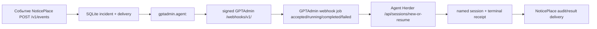

# Health Incident Autopilot — current-state feasibility and target contract

Дата исследования: 2026-08-09
Статус: research complete; implementation waits for plan selection and a
second technical-preview approval.

## Бизнес-результат

Нужен один доказуемый путь: деградация хоста, сервиса или лога → один
дедуплицированный инцидент → подробная диагностика → ровно три плана → явный
выбор пользователя → контролируемое исправление в Telegram-топике здоровья →
видимый прогресс до terminal state → сообщение об исправлении с длительностью и
трассами.

Минимальный business canary — контролируемая синтетическая деградация на
неproduction или явно разрешённой тестовой цели. Историческая запись, зелёный
unit/build или статус systemd не считаются доказательством результата.

## Вердикт осуществимости

В текущем стеке можно переиспользовать большую часть intake/approval/job
цепочки, но полного решения сейчас нет.

- Intake и delivery в NoticePlace, signed webhook в GPTAdmin и named-session
  handoff в Agent Herder уже доказаны чтением реализации.
- Host/service/log monitoring сейчас представлен разрозненными локальными
  watchdog-ами и Telegram-уведомлениями; нормализованный producer в GPTAdmin
  или NoticePlace не доказан.
- Job state и durable audit есть, но per-job heartbeat/progress, orphan
  reconciliation и единый cross-system trace отсутствуют.
- Hermes/OpenCode/OmniRoute имеют поддерживаемые seams, но наличие конфигурации
  не доказывает установленный runtime, provider authorization или точное
  соответствие `gpt-5.6-luna high`.

Следовательно, цель достижима без переписывания Hermes и без замены OpenCode,
но требует нового небольшого health-event/correlation/supervision слоя.

## Доказанная текущая цепочка



Подтверждения:

- NoticePlace принимает `POST /v1/events` с bearer auth и `Idempotency-Key`,
  хранит incident/delivery в SQLite и дедуплицирует unresolved incident по
  `(project, recipient, consumer_id, dedup_key)`:
  `/home/admin/agents-projects/noticeplace/notification_center/http_api.py:568-576`,
  `core.py:529-613`.
- Канал `gptadmin.agent:<job>` подписывает payload, сохраняет delivery key и
  опрашивает `/webhook-jobs/{job_id}`:
  `noticeplace/notification_center/http_api.py:399-416`,
  `gptadmin_agent.py:141-181`.
- GPTAdmin принимает webhook, сохраняет accepted/running/completed/failed,
  а callback failure отделяет от terminal job state:
  `/home/admin/gptadmin/go-hub/internal/hub/webhook_gateway.go:191-260,389-443`.
- Agent Herder предоставляет `/api/sessions/new-or-resume`; идентичность named
  session — `(harness, canonical cwd, name)`, с lock и resume semantics:
  `/home/admin/agents-projects/agent-herder/src/web/server.ts:139-154`,
  `src/named-session.ts:64-166`.

## Состояние сигналов здоровья

| Сигнал | Что доказано | Текущий consumer | Что отсутствует |
|---|---|---|---|
| CPU/RAM/disk | Netdata назван backend-ом, но unit inactive и listener `19999` не доказан; active sampler/threshold не найден | Нет доказанного GPTAdmin/NoticePlace consumer | Collector, cadence, severity, event schema, dedup key |
| Failed services / HA | Recovery watchdog публикует state changes `ha/100/failed` в Telegram; `recovery-status` — read-only snapshot | Telegram | Нормализованный service event и GPTAdmin handoff |
| External endpoints | Hourly VPN2 monitor требует две последовательные ошибки и шлёт aggregate Telegram alert | Telegram | API/MCP/webhook event contract и reconciliation |
| Error-level/keywords | Fail2Ban watches nginx/kernel logs, но это security enforcement, не incident feed | Fail2Ban | Cursor, keyword policy, severity, privacy filtering, event delivery |
| RAM/log pressure | One-minute systemd timer реагирует на tmpfs ≥75%, чистит файлы и может restart VPN | Local systemd/VPN | Incident publication, deduplication, approval-aware remediation |

Источники: `/home/admin/ServersAdministartion/docs/inventory/services/netdata.md:7-12`,
`infra/recovery.md:62-79,269-283`,
`infra/security.md:3-13`,
`automation/ram-log-guard/ram-log-guard.timer:4-8`,
`automation/ram-log-guard/ram_log_guard.sh:23-47`.

## Gaps, которые блокируют бизнес-canary

1. **Health producer.** Нет одного процесса/адаптера, который собирает
   host metrics, `systemctl --failed` и выбранные log rules, удаляет секреты и
   публикует нормализованный event в NoticePlace.
2. **Incident contract.** Нужны stable `source_id`, `host_id`, `signal_type`,
   `severity`, `dedup_key`, cursor/window, evidence references и expiry.
3. **Cross-system correlation.** Сейчас traces разделены между NoticePlace
   SQLite, GPTAdmin `webhook_state.json`, Agent Herder `lineage.json` и
   transcript archives. Нет доказанного общего correlation record.
4. **Liveness/reconciliation.** NoticePlace dispatcher heartbeat и delivery
   lease подтверждают здоровье delivery worker, но не прогресс конкретной
   диагностики/ремедиации. Herder queue может оставаться `accepted` без
   progress/heartbeat, а orphaned job не получает отдельный incident.
5. **Execution proof.** Hermes bridge экспортирует lifecycle events, OmniRoute
   отдаёт request/provider/model/latency telemetry, но нет authoritative
   pause/resume/approval owner и business-level resolved signal.
6. **Model mapping.** В разрешённых путях найден fallback
   `openai-codex/gpt-5.6-luna`, но не доказаны отдельный `high` field,
   OmniRoute catalog entry или установленный runtime/provider authorization.

## Минимальный correlation envelope

Это целевой контракт для выбранного плана, а не уже существующая схема:

```text
incident_id, source_id, host_id, signal_type, severity,
dedup_key, observed_at, evidence_refs, redaction_policy,
diagnosis_id, plan_id, selected_by, approval_mode,
gptadmin_job_id, herder_session_id, opencode_session_id,
hermes_session_id, hermes_turn_id, omniroute_request_id,
heartbeat_at, progress_state, terminal_state, resolved_at,
elapsed_ms, trace_refs
```

Личные данные и secret-bearing payloads не должны входить в envelope; в
Telegram и NoticePlace отправляются ссылки/opaque IDs и redacted evidence.

## Поддерживаемые extension seams

- Hermes: external `register_tool`/`register_hook` plugins, включая текущий
  Agent-Herder bridge; Hermes core не форкается.
- OpenCode: native Markdown profiles, permissions и adapter-owned resume
  metadata; официальный runtime не перезаписывается.
- OmniRoute: OpenAI-compatible `/api/v1/chat/completions`, model catalog и
  response telemetry headers; наличие overlay patch не считается доказательством
  его установки.
- NoticePlace/GPTAdmin/Agent Herder: существующие durable intake, signed
  webhook, polling, named-session и audit seams.

Эти правила согласованы с runtime source-ownership policy в
`/home/admin/agents-projects/AGENTS.md`.

## Acceptance proof после реализации

На разрешённой тестовой цели нужно зафиксировать один trace bundle:

1. synthetic CPU/disk/RAM, failed-service или log-keyword signal с host и
   evidence references;
2. один NoticePlace incident и один GPTAdmin job;
3. подробный diagnosis и ровно три плана;
4. явный пользовательский выбор в NoticePlace;
5. один Agent Herder/selected-runtime remediation execution в health topic;
6. минимум два progress/heartbeat receipts до resolution либо доказанный
   controlled failure/retry;
7. final NoticePlace receipt со `resolved`, elapsed time и correlation IDs;
8. независимая computer-use проверка только через user-facing surface без
   чтения исходников тестером.

## Ограничения исследования

- Запрошенный путь `~/serveradministation` отсутствует; использован существующий
  `/home/admin/ServersAdministartion`.
- Graphify дал полезную карту `3,296 nodes / 5,421 edges`, но 3/7 semantic
  chunks завершились connection error, 197 файлов не дали nodes, а
  `nginx-dev/state` был недоступен. Graphify evidence поэтому навигационная,
  не заменяет точечное чтение исходников.
- Runtime calls, Telegram sends, agent starts, restarts, deploys, provider
  checks и secret inspection не выполнялись.

## Реализационный статус после выбора плана

Выбран «Нормальный»; technical preview зафиксирован как рабочий документ и
не является второй точкой согласования. Локально реализованы producer,
корреляция, useful-progress supervisor, NoticePlace health workflow,
verification-gated resolution, Hermes progress/resolution tools и disposable
vertical canary. Внутренний canary доказал один incident, три плана, signed
selection, полезный progress/heartbeat, блокировку resolve до независимого
здорового источника и final receipt с elapsed/trace refs.

Для полного fleet-покрытия добавлен central SSH fan-out adapter: он использует
тот же `health_monitor` event normalizer, умеет fixed `journalctl`/`logread`
backends и превращает недоступность/невалидный probe в critical collector
incident. Это закрывает OpenWrt без Python и HAOS, не создавая второй schema
или второй dedup authority.

После независимого критического review probes fail closed: missing metrics,
unreadable configured logs, unavailable service/log backend, malformed remote
snapshot и SSH timeout становятся collector signal; verification sender
отправляет receipt только при `verified=true`. Production preflight требует
HTTP 200 health route, active stack, authenticated OpenCode readiness и active
collector timer/config.

Остаются только внешние границы: production route/topic/token configuration,
restart/deploy и реальная отправка в Telegram. Они намеренно не выполнялись;
для них нужен approval непосредственно перед действием.

## Hardening after independent review

После первого Reviewer/Critic gate исправлены дополнительные state-machine
границы:

- выбор плана защищён durable SQLite single-winner guard, поэтому lock не
  ограничен одним Python-процессом; выбор до `health.plans_attached` отклоняется;
- пустой или heartbeat-only progress отклоняется до записи и не может открыть
  resolve gate;
- исходный `health.fingerprint` сохраняется как `source_fingerprint`, а
  независимая healthy verification с другим fingerprint отвергается;
- Hermes direct resolution receipt ограничивает actor/session, отвергает
  secret-like prefixes (`token:`, `secret:`, `api-key:` и т.п.) и имеет bounded
  serialized body;
- metric incident fingerprints теперь описывают устойчивый degraded signal, а
  не текущее числовое значение: продолжающаяся CPU/RAM/disk деградация не
  создаёт новый incident на каждом timer tick; для services/logs сохраняются
  identity names/keywords, но не меняющиеся counts;
- vertical canary печатает provenance: реальные local health producer и
  NoticePlace HTTP, downstream GPTAdmin/OmniRoute/Agent-Herder/Telegram —
  deterministic fakes, `external_sends: false`.

Свежий black-box Tester через BrowserOS подтвердил пользовательскую admin
поверхность: фильтр по `node-blackbox` показывает `health.disk`, ровно три
плана, selection, progress, verification и `resolved`; mutating формы не
отправлялись.

Актуальные bounded checks после hardening: local/fleet health producer `12 passed`,
NoticePlace health/API/GPTAdmin `39 passed`, Hermes bridge `10 passed`,
Agent-Herder `tsc` + HTTP Vitest `5 passed`, GPTAdmin Hub `go test
./internal/hub`, vertical canary passed with `external_sends: false`. Полный
NoticePlace suite: `142 passed, 1 failed`; единственный failure — отдельный
Telegram policy regression, зафиксированный в
`.agents/tasks/todo-20260809-noticeplace-telegram-controls-regression.md`.

Последний rerun тех же изменённых компонентов повторён после wrapper/bridge и
producer dedup hardening: `health producer 7`, `NoticePlace 39`, `Hub go test`, `Herder tsc +
HTTP Vitest 3`, `Hermes 10`, canary resolved with `external_sends: false`.

## Live activation audit

Read-only live audit выявил, что production release ещё не содержит source-level
health workflow: `/opt/noticeplace` не имеет `notification_center/health_workflow.py`,
live Agent-Herder `dist` не имеет health-progress route, а `hermes-gateway.service`
failed и CLI отмечает устаревший unit. Существующий `fleet-health.timer` уже
проверяет CPU/disk/RAM раз в три часа, но не failed services/log keywords.
Точный порядок активации и approval gates зафиксирован в
`docs/health-incident-autopilot-production-activation-preview-2026-08-09.md`.
