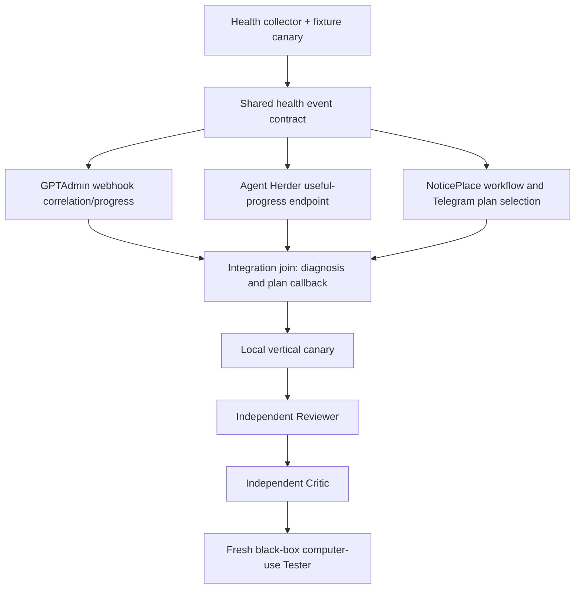

# Health Incident Autopilot — implementation technical preview

Дата: 2026-08-09
Selected plan: **Нормальный**
Authority: the source business acceptance contract in
`work-20260809-health-monitoring-orchestration.md`.

This is an implementation artifact, not a second approval gate. Production
restart/deploy, secret changes, destructive actions, and real external Telegram
sends remain approval boundaries at the exact action.

## Call-stack

```text
health_monitor.py --fixture fixtures/degraded.json --json
  -> normalized notify.event.v1 (health source + redacted evidence)
  -> NoticePlace POST /v1/events + Idempotency-Key
  -> one incident + durable event/audit + gptadmin.agent:health-diagnosis
  -> GPTAdmin signed webhook route
  -> Agent Herder /api/sessions/new-or-resume
  -> OpenCode/OmniRoute diagnosis result
  -> GPTAdmin/NoticePlace health plans update (exactly 3 plans)
  -> NoticePlace Telegram plan buttons
  -> signed plan-selection callback
  -> allowlisted remediation session through Agent Herder/Hermes
  -> useful-progress receipts (step/evidence change, not heartbeat alone)
  -> independent source verification receipt
  -> NoticePlace resolve only after verification
  -> final receipt: resolved, elapsed_ms, correlation/trace IDs
```

The local workflow also exposes the explicit post-diagnosis control seams:

```text
POST /v1/health/signals
POST /v1/incidents/{incident_id}/health/plans
POST /v1/incidents/{incident_id}/health/progress
POST /v1/incidents/{incident_id}/health/verification
POST /v1/incidents/{incident_id}/health/resolve
```

Health intake does not attach generic plans. Exactly three plans are attached
only after the diagnosis/OmniRoute step, and only that attached bundle is
rendered as signed Telegram buttons. `health` is an explicitly supported
Telegram topic mode; production must configure its allowlisted topic route and
active mode before any external send.

### Two-stage model contract

The diagnosis delivery is intentionally two-stage:

```text
OpenCode + OmniRoute/subagent
  -> bounded read-only diagnosis JSON
  -> separate Agent-Herder/OpenCode session
  -> logical role OmniRoute/orchestrator
  -> effective live model OmniRoute/free-stack
  -> exactly three plans
```

The literal upstream ID `omniroute/orchestrator` was tested and rejected by
OpenCode as `ProviderModelNotFoundError`. It therefore remains a requested
logical role in durable provenance, while the allowlisted effective route is
explicitly `omniroute/free-stack`; missing or altered mapping fails closed.
The durable `health.plans_attached` receipt retains both session IDs, both
model identities, bounded stage timings, and the Agent-Herder/OpenCode trace
for each stage.

## File-tree diff

```text
/home/admin/ServersAdministartion/
  automation/health-incident-monitor/health_monitor.py       [new]
  automation/health-incident-monitor/README.md              [new]
  automation/health-incident-monitor/fixtures/*.json        [new]

/home/admin/agents-projects/noticeplace/
  notification_center/health_workflow.py                    [new]
  notification_center/core.py                               [update]
  notification_center/http_api.py                           [update]
  notification_center/telegram_interactions.py              [update]
  notification_center/gptadmin_agent.py                     [update]
  tests/test_health_workflow.py                              [new]

/home/admin/agents-projects/agent-herder/
  src/health-progress.ts                                    [new]
  src/web/server.ts                                         [update]
  tests/health-progress.test.ts                             [new]

/home/admin/gptadmin/
  go-hub/internal/hub/webhook_gateway.go                    [update]
  go-hub/internal/hub/webhook_gateway_test.go               [update]

/home/admin/agents-projects/hermes-config/
  plugins/agent-herder-bridge/__init__.py                   [update]
  plugins/agent-herder-bridge/README.md                     [update]
```

No Hermes core fork, official OpenCode overwrite, provider secret, or runtime
deployment is part of this diff.

The Hermes plugin has optional direct NoticePlace endpoints for progress and
resolution. They are disabled unless their URL and bearer token are explicitly
configured, and the plugin reports `unsupported` instead of claiming a receipt
was reconciled when the endpoints are absent.

## Key types and signatures

```python
HealthSignal = {
    "host_id": str,
    "signal_type": Literal["cpu", "ram", "disk", "service", "log"],
    "severity": str,
    "observed_at": float,
    "dedup_key": str,
    "evidence_refs": list[str],
    "summary": str,                 # redacted, bounded
}

HealthProgress = {
    "incident_id": str,
    "correlation_id": str,
    "plan_id": str,
    "step": str,
    "useful_change": bool,
    "evidence_refs": list[str],
    "observed_at": float,
}

def verify_resolution(
    incident_id: str,
    source_id: str,
    verification_id: str,
    observed_state: Literal["healthy", "degraded"],
) -> dict: ...
```

```typescript
type HealthProgressSnapshot = {
  sessionId: string;
  status: AgentStatus;
  lastActivity: string;
  messageCount: number;
  usefulProgress: boolean;
  progressFingerprint?: string;
  evidenceRefs?: string[];
};

GET /api/sessions/:harness/:id/progress
  -> { session, useful_progress, progress_fingerprint, evidence_refs }
```

The GPTAdmin-side `HealthProgressSupervisor` classifies the last useful
fingerprint as `progressing`, `stalled`, `waiting`, or `terminal`; timestamp-only
heartbeat entries do not reset the useful-progress clock.

```go
type webhookJob struct {
    // existing fields...
    CorrelationID  string           `json:"correlation_id,omitempty"`
    LastProgressAt time.Time        `json:"last_progress_at,omitempty"`
    Progress       []map[string]any `json:"progress,omitempty"`
    TraceRefs      []string         `json:"trace_refs,omitempty"`
}
```

## Pseudocode

```python
event = monitor.collect()
if event.degraded:
    notice_id = notice.create_event(event, idempotency_key=event.dedup_key)

diagnosis = gptadmin.diagnose_with_subagent(notice_id)
plans = gptadmin.orchestrate_with_effective_model(
    notice_id,
    diagnosis,
    requested_role="omniroute/orchestrator",
    effective_model="omniroute/free-stack",
)
assert len(plans) == 3
notice.attach_plans(notice_id, plans)

selection = await notice.wait_for_plan_selection(notice_id)
execution = herder.start(remediation_prompt(selection.plan_id))
while execution.active:
    snapshot = herder.useful_progress(execution.session_id)
    supervisor.record(snapshot)
    if supervisor.stalled_without_useful_change():
        supervisor.escalate_or_recover()

verified = monitor.verify_original_signal(event.source_id)
if not verified.healthy:
    raise ResolutionRejected("terminal agent status is not source verification")
notice.resolve(notice_id, verification=verified, traces=execution.traces)
```

## Migration and authorization boundaries

1. Add code and fixture canaries only; no runtime state changes.
2. Run unit/black-box checks with fake NoticePlace/GPTAdmin/Herder/Telegram
   transports.
3. Run a local in-process vertical canary with a synthetic degraded fixture.
4. Before enabling a real host collector or external send, ask approval for the
   exact target, URL/channel, and expected side effect.
5. Before production restart/deploy or secret installation, ask again at that
   exact boundary.

## Execution graph



Parallel lanes have disjoint write sets. The join is the correlation contract;
after the join, verification is sequential and source-driven.

## State-machine hardening applied during implementation

The preview's health workflow is now stricter than a terminal receipt alone:

- a SQLite primary-key guard makes signed plan selection one-winner across
  independent NoticePlace processes, and no selection is accepted before the
  exactly-three diagnosis plans are attached;
- useful progress requires non-empty step, evidence, or fingerprint content;
  heartbeat-only updates are rejected before persistence and cannot satisfy
  resolution;
- the producer fingerprint is carried as `source_fingerprint` and a healthy
  independent verification must match it when present;
- Hermes direct receipts use bounded opaque actor/session IDs, reject
  secret-like prefixes, and enforce a bounded serialized resolution body;
- the vertical canary reports real local versus fake downstream transports and
  `external_sends: false`.

## Acceptance receipts

The implementation is not accepted by build/test status alone. The final
evidence bundle must include:

- one incident ID and stable dedup key;
- diagnosis and exactly three plan IDs;
- signed user plan selection;
- selected remediation session IDs;
- at least one useful-progress change plus any stall/recovery receipt;
- independent healthy verification of the original source;
- resolved NoticePlace receipt with `elapsed_ms`, `correlation_id`, and trace
  references.

## Live implementation receipt (2026-08-09)

The Fleet/SSH activation is complete for server-100: the health credential
scope is present, `health-incident-fleet.timer` is active/enabled,
`fleet-health.timer` is inactive/disabled, and Telegram health delivery is
fail-closed until its mode is explicitly activated. NoticePlace, Agent
Herder, and the relevant health sources are installed with backup-first
deployment and active services.

The live v8 synthetic canary reached `health.plans_attached` with no
remediation selection and no infrastructure mutation:

- incident `inc_46980135c4e643f0bb3464727beb3e0d`;
- diagnosis `omniroute/subagent`, orchestrator effective
  `omniroute/free-stack`, requested role `omniroute/orchestrator`;
- diagnosis `6288 ms`, orchestrator `12775 ms`, stage total `19063 ms`;
- both Agent-Herder and OpenCode traces are present for both sessions;
- Telegram deliveries were cancelled with `Telegram mode is inactive`.

This is a green diagnosis/planning canary, not a complete business acceptance
receipt: user plan selection, remediation, useful-progress supervision during
repair, independent verification, and final resolved receipt are still
pending by contract.

## Hermes remediation seam — live update (2026-08-10)

Agent-Herder now has a real bounded Hermes CLI job adapter for the remediation
stage. It launches the installed Hermes binary with `chat -q`, explicit
`openai-codex/gpt-5.6-luna/high` parameters, and the terminal-only toolset;
the observation-only Hermes MCP bridge is no longer on the health-job critical
path and has a 2.5-second timeout. Jobs expose a synthetic Agent-Herder
session, native Hermes session ID, bounded CLI trace, real output progress,
useful status, and cancel/terminate controls. A 20-minute watchdog terminates
stalled jobs with SIGTERM and bounded SIGKILL escalation.

Build and focused tests passed (`11 passed`); the full Agent-Herder suite passed
(`105 passed`). The earlier live no-tool canary completed:

- Agent-Herder session: `hermes-job-1421ec17-56f4-4c67-90f7-6ad1de2c4ccb`;
- native Hermes session: `20260810_000540_1484a9`;
- terminal status: `stopped`;
- result: `HERMES_AGENT_HERDER_CANARY_OK`;
- no file mutation, Telegram delivery, or external service action.

The Fleet health-remediation profile is now applied and verified as
`harness=hermes`, `model=gpt-5.6-luna`, `reasoning=high`, `topic=health`.
Diagnosis remains the separate OpenCode/OmniRoute stage. This proves the
Hermes execution seam only; it does not select a real remediation plan or
claim an incident resolved.

The independent Reviewer/Critic gate initially returned `CHANGES_REQUIRED` /
`RETHINK`: the live PID predated the build, the tracked unit omitted the
Hermes environment, the CLI job had no watchdog, and its execution profile and
trace/progress provenance were not fail-closed. Those findings are fixed in
the current source: request-bound profile validation, `observed-cli-output`
trace export with redaction, real CLI output progress, and the 20-minute
watchdog are covered by the 11 focused tests. The current source is built, but
the service restart and post-restart live canary remain deployment-gated.

## Current-dist isolated canary (2026-08-10)

An isolated localhost process running the fresh `dist` (Hermes only, no
Telegram/OpenCode adapters) completed the no-send canary. The CLI receipt
parser was corrected after observing the progress-visible Hermes format
`Session: <id>`; it now accepts both `Session:` and `session_id:` and excludes
the receipt line from useful progress.

Receipt: Agent-Herder session
`hermes-job-c7edec59-fb65-48e8-8cfe-59453e84c4f5`, native Hermes session
`20260810_003911_bcf369`, terminal `stopped`, transport `hermes-cli-job`,
history `observed-cli-output`, progress fingerprint present, 10 evidence refs,
and exact canary response. Focused tests remain `11 passed`; full suite
`105 passed`. This proves the current artifact in isolation, not the stale
production PID and not the full incident/Telegram business canary.

## NoticePlace to Hermes profile seam correction (2026-08-10)

The applied Fleet profile was read back as `harness=hermes`,
`model=gpt-5.6-luna`, `reasoning=high`, `topic=health`, but the source
NoticePlace helper still rejected Hermes and checked the old
`openai-codex/gpt-5.6-luna` profile. That was a real delivery blocker between
plan selection and Agent Herder.

NoticePlace source now allowlists Hermes and fail-closed pins the exact
`hermes/gpt-5.6-luna/high/health` remediation profile. The example JSON and
operator documentation were synchronized. Focused NoticePlace/health tests
pass (`37 passed`) and the example JSON parses. The fix is committed as
`1ee7365`; live `/opt/noticeplace` deployment and service restart are still
explicit production boundaries.

## Isolated NoticePlace to Agent-Herder Hermes canary (2026-08-10)

The corrected NoticePlace helper was exercised against a fresh isolated
Agent-Herder `dist` process. It accepted the Hermes profile and dispatched a
real CLI job: session `hermes-job-0ff20c98-dc82-499b-a786-964292d5ccc8`, native
Hermes session `20260810_005140_cc3024`, terminal `stopped`, transport
`hermes-cli-job`, history `observed-cli-output`, progress fingerprint and 10
evidence refs present, exact canary response. This proves the current
NoticePlace→Agent-Herder→Hermes handoff in isolation, not production delivery,
Telegram, user selection, independent verification, or resolution.
